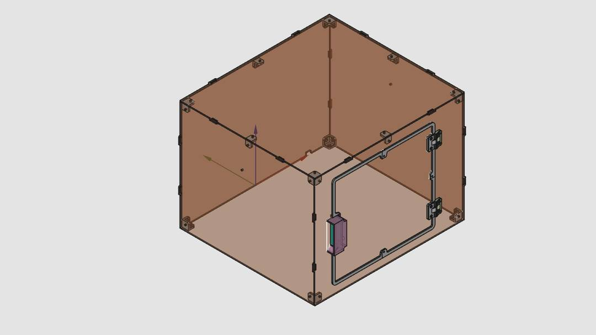

## Medjed Enclosure

The FreeCAD file in this directory can be used to export `.dxf` files that define cut lines for acrylic panels.  In addition, there are printed parts that can be printed on a standard filament 3D printer. PLA is probably adequate, but if you plan on treating it particularly aggressively you may want to print the structural pieces out of PETG.

Use the **legacy** exporter for dxf, as the new one has some issue at time of writing (2023).

There are 5 panels total

* Front panel (this one is kept as a solid piece, to lower costs; some separation needed when you receive it)
* Back panel
* Side panel 1
* Side panel 2 (identical to panel 1)
* Top panel

The design features print-in-place hinges, which seem to print fine out of PLA, long term durability unknown. Print settings: Prusa Mini+. Polyterra PLA, 0.4mm nozzle, 0.2mm layer height.

###  Parts list

1. Acrylic panels (3mm thick; for thicker panels you need to adjust the designs a bit)
2. 3D printed parts (PLA seems to work OK, PETG preferred)
4. [Omron micro switch: D2F-01F-D](https://nl.rs-online.com/web/p/micro-switches/6867688)
5. M5 nut (with plastic collar would be preferred) [4X]
6. M4 bolts (10mm shaft length) and nuts (with plastic collar would be preferred) [35X]
7. M2 bolts and nuts for micro switch attachment [2X]

### Material choice

I suggest you have the enclosure cut out of orange acrylic. Ideally, choose an acrylic material of which you know the absorption at the relevant wavelengths (centered at 405nm, but consider 390-420). It would be good to have the enclosure made out of material with high absorption in this range (99.9%+). Since the focus of the objective (and hence the UV) is always far away from the user (provided they are not inside the enclosure) very high OD is not needed I suspect (please check safety considerations by yourself).

Something like 

* Plexiglas `ORANGE 2C04`
* Green Cast `orange`

*Note that neither of the above have published transmission spectra (that I could find), and may still transmit a significant amount of UV light.*

> **Note**
>
> There is a small test object in the main freecad file that you can order before ordering the main pieces. That tolerance piece can help you tune the tolerances of your cut acrylic supplier.

### A note on DXF export

The FreeCAD `.dxf` export produces files that may not be interpreted correctly by all manufacturers. A solution it to take legacy-dxf export from FreeCAD and open and re-export it via Fusion360. 

If you don't need to modify the panels yourself you can also use the provided [`.dxf` files](./dxf)