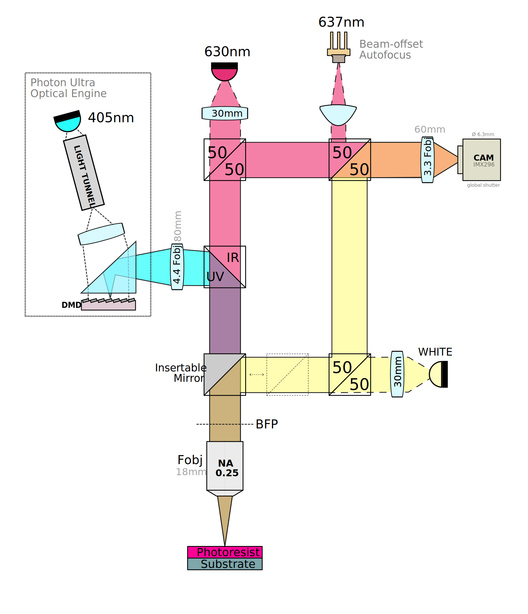
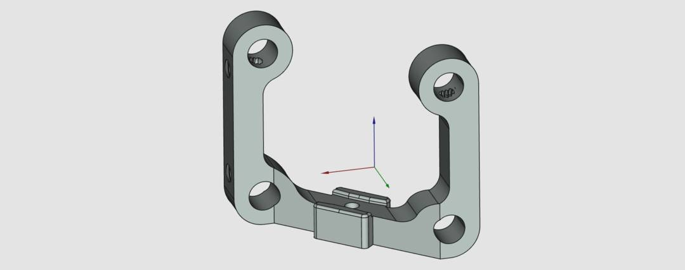
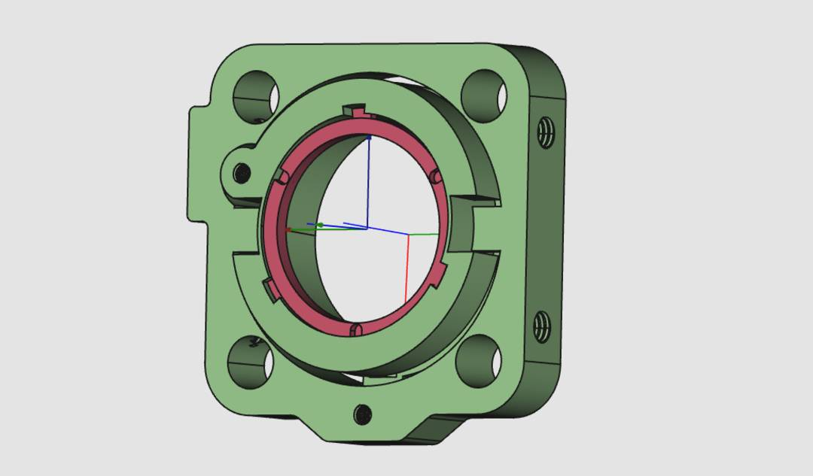

# Medjed Optics

### A quick note on motivations

The optical design is not designed to reach the absolute lowest cost possible, but rather prioritises the long-term availability of the components and ease of part sourcing. As such, many parts will be sourced from Thorlabs , and supplemented with 3D printed parts where possible. When components are chosen, they will still generally be on the lower-end of parts, as the Medjed is not a high resolution optical system (compared to what one may typically make with Thorlabs parts.)

For more detailed justifications for part choices and focal length, consult the [wiki page](../../Medjed.wiki/optics.md)

### A note on organisation

There are 3 different big assemblies in the origin. This is a bit confusing, but this was the only way to get around the "1 assembly per file" constraint of the `Assembly4` workbench. 

1. `assembly-optical` is the base assembly, which contains the base UV unit of the Photon Ultra.
2. `assembly-optical-stock` is the optical assembly, as used in the photon ultra (i.e. base assembly + lens)
3. `assembly-optical-medjed` is the main optics for the Medjed system.  **🔎 This is the main file to explore.**

## ☀ Ray Tracing with the Optics workbench

For the 60mm doublet I have used a fixed refractive index evaluated at 630nm. This is because the optics workbench does not support Cauchy coefficients, which are [the ones listed for the glass variants used in the lens](https://refractiveindex.info/?shelf=glass&book=HOYA-FD&page=E-FD10).

## Optical Elements and Mounts

To keep the assembly compact and reduce cost, some of the optical mounts are designed specficially for the project. The more complex parts are designed around SLS prints (i.e. not filament printer friendly), but some can be printed on a filament printer with adequate supports.

### 45 degree optical mount

Simple mount with single degree of freedom (rotation along Z axis of ±5 deg). Suitable for applications that do not require super precise alignment. Part holding the optic is to be designed and printed separately (can be done on filament printer). The part is to hold an optical element angled at 45 degrees. Useful for e.g. beamsplitters or dichroic filters.

Secured with m4 grub screws like other Thorlabs elements.

### Inline tip-tilt for 1-inch optics

Tip tilt actuator for 30mm cage system with tip tilt adjustment (M3 setscrew). Has a base model that is to be modified for each lens element in the design (tune to lens curvature).

