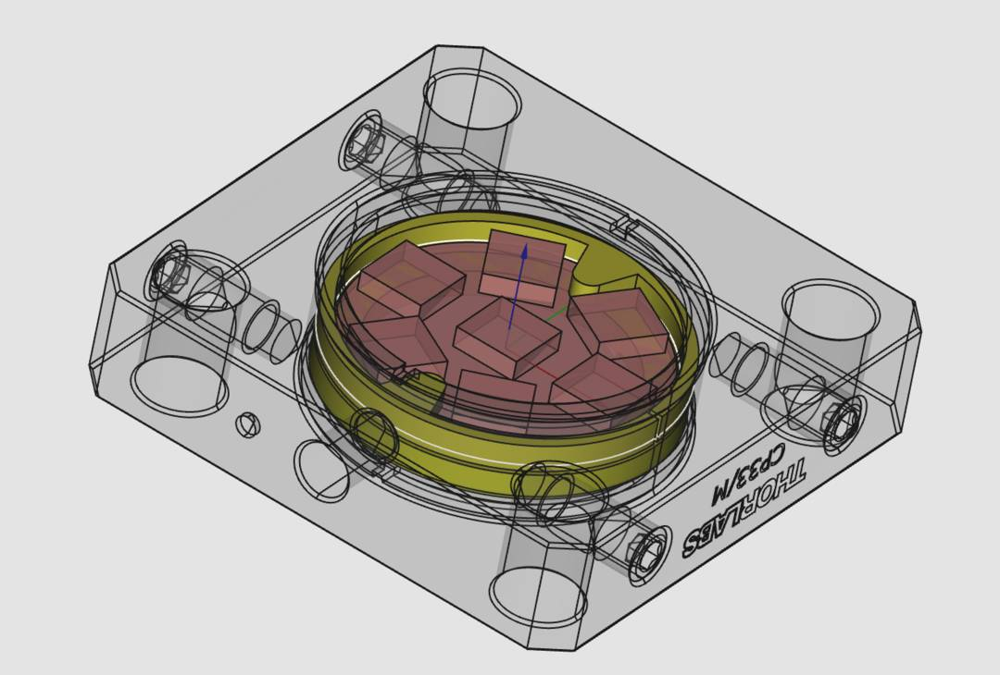

# Adafruit Jewel cage plate mount

Simple printed shims to secure an adafruit jewel LED PCB into a Thorlabs CP33 cage plate.

Can be printed out of PLA or any kind of filament really. Doesn't need very high precision.

