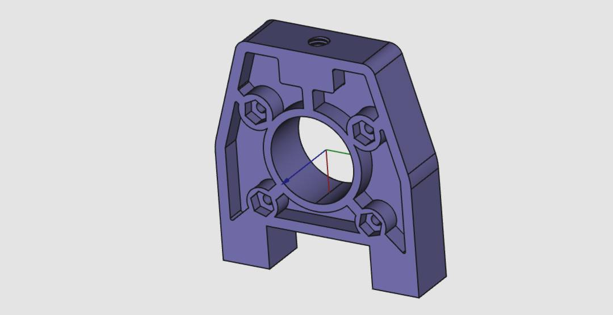

# Optical Engine Bracket

This part connects the eViewTek optical engine to the rest of the build.

It is meant to be SLS printed, but with some modification and heat inserts you could print it out of PETG or similar.

