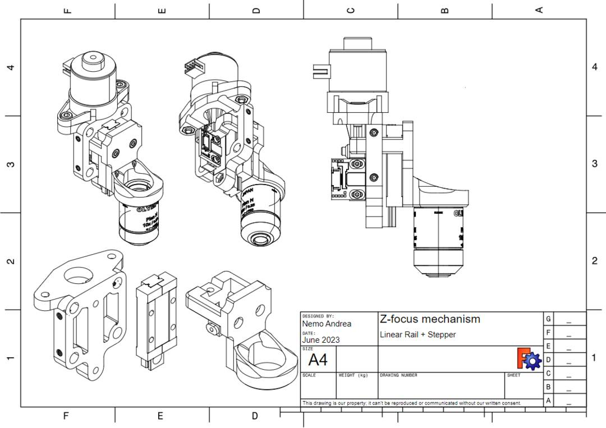
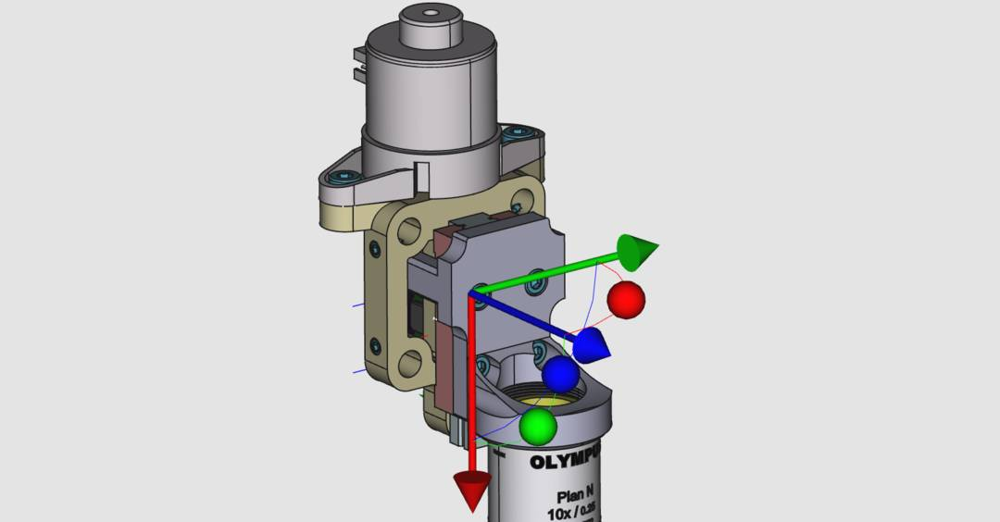

## Fine Z-axis

The Medjed system needs to be able to focus the objective with a precision at least as good as the lateral resolution (5um target). The coarse Z-motors will not even get close to this. 

Thus, a separate fine focus mechanism is needed. 

**🏗 This this still in the prototype phase, please check out the GitHub discussions to see latest in development and experiments regarding this component.**

### Z positioner based on linear rail

[Open in FreeCAD](z-positioner-assembly-stepper-linrail.FCStd)

Besides the linear rail, and encoder, you will need the following bits:

* 2x M4 (ISO 4762) bolts for stepper mount. 8 or 10 mm length.
* 2x M4 hex nuts (ISO 4032)
* 4x M3 4mm (ISO 4762) to mount objective bracket to rail
* 2x M3.5 8mm (ISO 4762) to mount rail to cage bracket
* 2x M3.5 hex nuts (ISO 4032)
* 4x M4 grub screw (ISO 4026) to secure the part against the cage rods
* 2x M2 10mm (ISO 4762) for encoder mounting
* 2x M2 hex nuts (ISO 4032)

